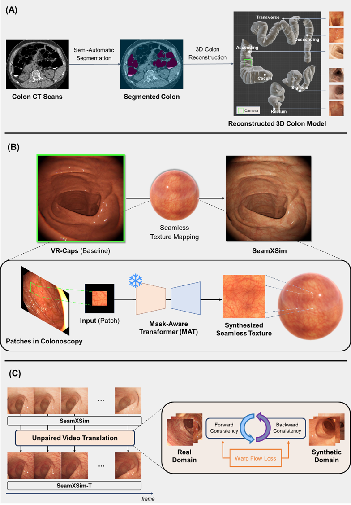

# SeamXSim
Official code for SeamXSim

**SeamXSim: Seamless-textured virtual colonoscopy simulator via unpaired long-term video translation**

 

   
 

# Visualizations

|         SeamXSim          |       SeamXSim-T       |
|:------------------------:|:------------------------:|
|       |     |
|       |     |

We provide a test set for the virtual colonoscopy simulator here: [https://drive.google.com/file/d/1FnEX43IIbsEXQEe2480oJyxufrAs6AK7/view?usp=sharing]
The test set consists of videos(mp4 format) navigating three different sections of 3D colon models created from 10 CT scans. Each video is 5-10 seconds long and is composed based on the rectum texture.
